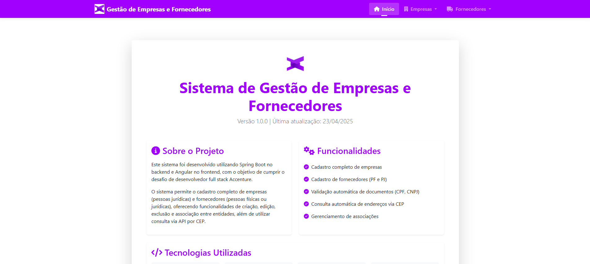
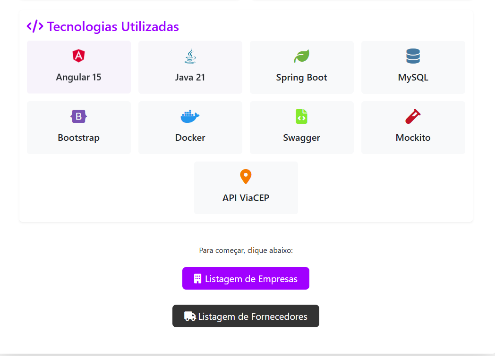
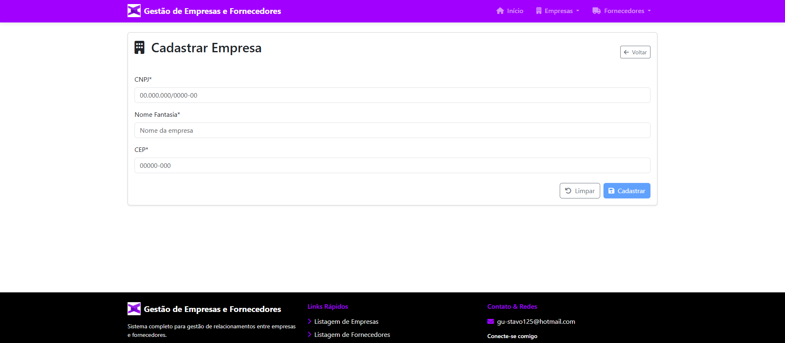
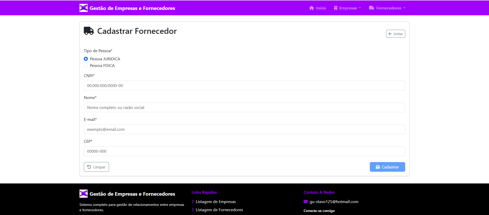
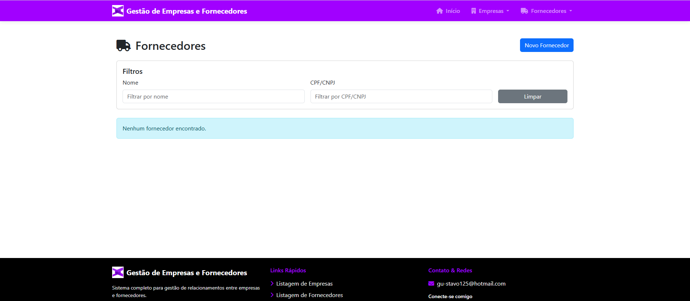
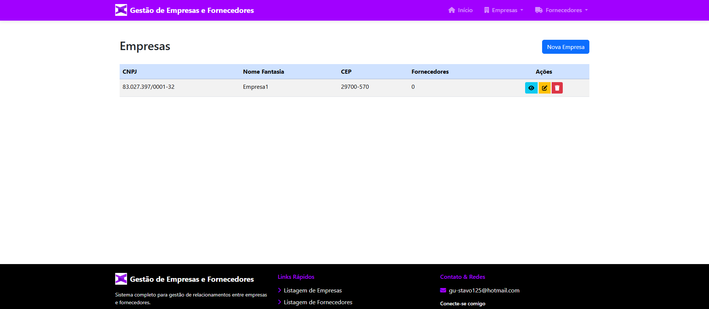
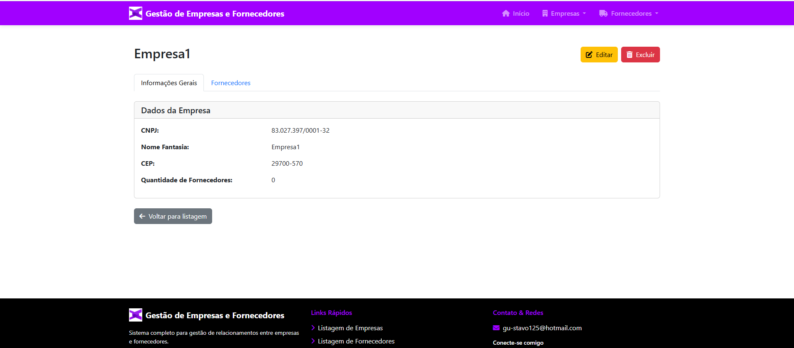
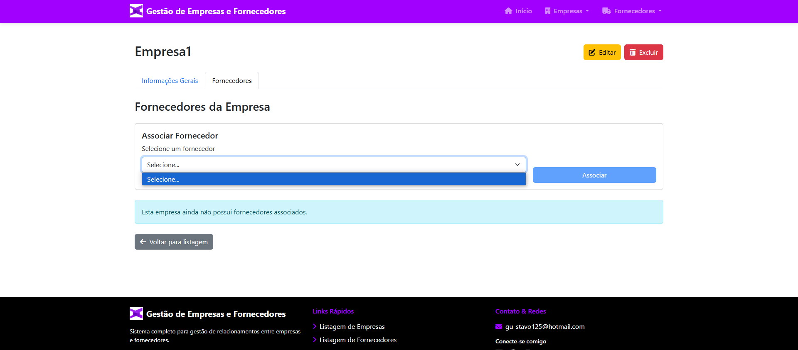

# Sistema de Gerenciamento de Empresas e Fornecedores - Desafio Full Stack Accenture

## 📝 Descrição do Projeto
Sistema completo para gestão de empresas e seus fornecedores, com frontend em Angular 15 e backend em Spring Boot (Java 21), utilizando MySQL como banco de dados.

## 🚀 Funcionalidades Implementadas
- **CRUD completo** para Empresas e Fornecedores  
- Relacionamento **N-N** entre Empresas e Fornecedores  
- Validação de **CNPJ/CPF** como valor único  
- Tratamento especial para **Pessoa Física** (RG e data de nascimento)  
- Restrição para **menores de idade** no Paraná  
- Filtros avançados na listagem (Nome e CPF/CNPJ)  
- Integração com **API ViaCEP** para validação de CEP  
- **Swagger** para documentação da API  
- **Testes unitários** com Mockito  
- **Dockerização** da aplicação  

## 🛠️ Tecnologias Utilizadas

| Área           | Tecnologias                                                                 |
|----------------|------------------------------------------------------------------------------|
| **Frontend**   | Angular 15, Bootstrap, HTML5, SCSS, TypeScript                              |
| **Backend**    | Java 21, Spring Boot, Spring Data JPA, Spring MVC                           |
| **Banco**      | MySQL                                                                        |
| **Ferramentas**| Docker, Swagger, Mockito                                                    |

## ▶️ Como Executar o Projeto

### ✅ Pré-requisitos
- Docker instalado  

### 📦 Via Docker Compose (recomendado)
```bash
git clone https://github.com/voidGustavoNunes/DesafioAccenture
cd AccentureCrud
docker-compose up --build
🚨🚨 IMPORTANTE: lembre-se de configurar as variaveis de banco no aplication.proprieties!
```

Acesse:  
- **Frontend:** `http://localhost:80`  
- **Swagger:** [http://localhost:8080/swagger-ui.html](http://localhost:8080/swagger-ui.html)  

---

## 📁 Estrutura do Projeto

### Backend (`/backend`)
```
src/
├── main/
│   ├── java/com/voidGustavoNunes/Accenture/
│   │   ├── config/          # Configurações do Spring
│   │   ├── controller/      # Controladores REST
│   │   ├── exception/       # Tratamento de exceções
│   │   ├── model/           # Entidades JPA
│   │   ├── repository/      # Interfaces JpaRepository
│   │   ├── service/         # Lógica de negócio
│   │   └── AccentureApplication.java
├── resources/
│   └── application.properties  # Configurações da aplicação
```

### Frontend (`/frontend/projeto-accenture`)
```
src/app/
├── components/
│   ├── associacao/        # Componentes de associação Empresa-Fornecedor
│   ├── empresas/          # Componentes de CRUD de Empresas
│   ├── fornecedores/      # Componentes de CRUD de Fornecedores
│   └── shared/            # Componentes compartilhados
├── modules/               # Módulos da aplicação
├── services/              # Services Angular
└── app.module.ts          # Módulo principal
```

---

## 🔮 Melhorias Futuras

### Backend
- Implementar Soft Delete para manter histórico  
- Adicionar auditoria (data de criação/alteração)  
- Melhorar tratamento de erros com códigos específicos  
- Implementar cache para consultas frequentes  
- Adicionar paginação nas listagens  

### Frontend
- Implementar confirmação para ações críticas  
- Adicionar toast notifications para feedback do usuário  
- Criar dashboard com métricas  
- Melhorar responsividade para dispositivos móveis  

### Banco de Dados
- Adicionar índices para campos de busca  
- Implementar histórico de alterações  
- Adicionar campos adicionais:  
  - **Empresas:** Razão Social, Telefone  
  - **Fornecedores:** Telefone, Endereço completo  

---

## 🧪 Testes
```bash
cd backend
mvn test
```

---

## 📄 Documentação da API
Acesse a documentação Swagger em:  
[http://localhost:8080/swagger-ui.html](http://localhost:8080/swagger-ui.html)

---

## 🤝 Contribuição
Contribuições são bem-vindas!  
Sinta-se à vontade para abrir **issues** ou enviar **pull requests**.  

## 📸 Fotos do Projeto

### 🖼️ Tela 1


### 🖼️ Tela 2


### 🖼️ Tela 3


### 🖼️ Tela 4


### 🖼️ Tela 5


### 🖼️ Tela 6


### 🖼️ Tela 7


### 🖼️ Tela 8



Obrigado a todos pela oportunidade!
